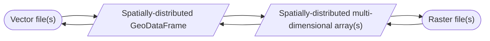

# Problem statement

## Vector file(s)

- One of more vector files, containing one of more layers, that represent a single spatial dataset.
- May be stored on disk either locally or remotelly.
- May be partitioned spatially or aspatially.

## Options

### Spark / Databricks

TODO

### Dask / [Pangeo](https://pangeo.io/)

TODO

### Hybrid

- Read vector file(s) from disk into an aspatial Spark DataFrame (i.e. a vanilla Spark DataFrame with the geometry column encoded as WKB or WKT) 
- Use a Spark spartial library (Sedona, GeoMesa, Mosaic, Geode, etc) to convert it to a spatial Spark DataFrame (i.e. geometry column encoded as a UDT)
- Do stuff
- Write out to (Geo)Parquet
- Read (Geo)Parquet into `sds_data_model`
- Rasterise
- Do stuff
- Write out to zarr   
