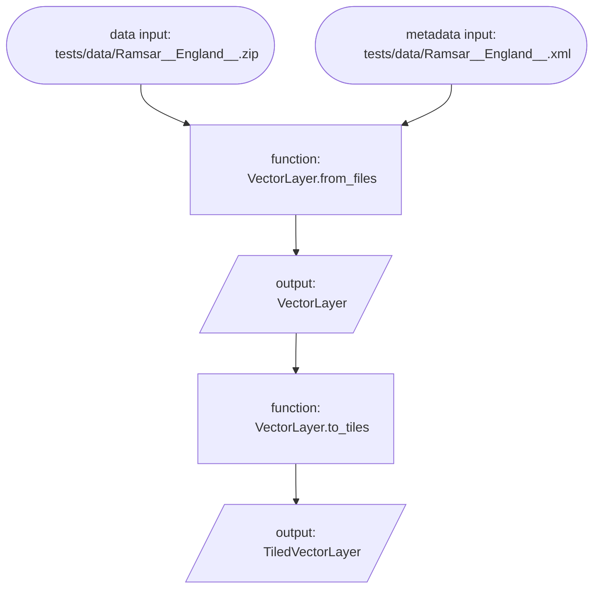
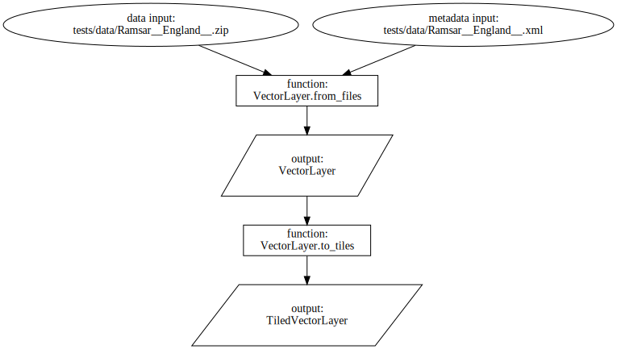

# Red-Green-Refactor

I've mentioned the Red-Green-Refactor testing strategy a few times, claiming that it's just a more explicit version of what we're already doing when we develop code, but the discussion has been quite abstract: what does it actually look like in practice?

Well, I'm currently working on [Implement transformation history as a DAG](https://github.com/Defra-Data-Science-Centre-of-Excellence/sds-data-model/issues/56), and I thought this might be as good an opportunity as any to practice what I preach.

## Goal

So, first things first, what am I trying to do?

I want to visualise the process of reading vector data and associated metadata from disc and transforming it into our common raster specification. I've decided that the best way to do this is to generate a Directed Acyclic Graph (DAG) which captures the data states and transformations as nodes with edges indicating the flow from one to another.

I will use flowchart convention of representing the beginning and end of the process with "terminal" nodes (i.e. oval nodes), "process" nodes (i.e. rectangular nodes) to represent transformations, and "input/output" nodes (i.e. rhomboid nodes) to represent data states. For my purposes, the "terminal" nodes will represent data on disk, the "process" nodes will represent functions and methods, and the "input/output" nodes will represent data in memory.

## A simple example for testing

The simplest example I can think of is reading data and metadata into a `VectorLayer`, then convert it to a `TiledVectorLayer`:

```python
from sds_data_model.vector import VectorLayer

vector_layer = VectorLayer.from_files(
    data_path="tests/data/Ramsar__England__.zip",
    metadata_path="tests/data/Ramsar__England__.xml"
)

tiled_vector_layer = vector_layer.to_tiles()
```

## A DAG for this example

So, what would the DAG for this look like?

I came up with the following in `mermaid`:



Which I then wrote in python using `graphviz`:

```python
from graphviz import Digraph

dag = Digraph()

dag.node("data_path", label="data input:\ntests/data/Ramsar__England__.zip", shape="oval")
dag.node("metadata_path", label="metadata input:\ntests/data/Ramsar__England__.xml", shape="oval")
dag.node("VectorLayer.from_files", label="function:\nVectorLayer.from_files", shape="box")
dag.node("VectorLayer", label="output:\nVectorLayer", shape="parallelogram")

dag.edge("data_path", "VectorLayer.from_files")
dag.edge("metadata_path", "VectorLayer.from_files")
dag.edge("VectorLayer.from_files", "VectorLayer")

dag.node("VectorLayer.to_tiles", label="function:\nVectorLayer.to_tiles", shape="box")
dag.node("TiledVectorLayer", label="output:\nTiledVectorLayer", shape="parallelogram")

dag.edge("VectorLayer", "VectorLayer.to_tiles")
dag.edge("VectorLayer.to_tiles", "TiledVectorLayer")

dag.save("tests/data/ramsar_dag.dot")
```

Which produces this:

```dot
<!-- ramsar_dag.dot -->
digraph {
    data_path [label="data input:
    tests/data/Ramsar__England__.zip" shape=oval]
    metadata_path [label="metadata input:
    tests/data/Ramsar__England__.xml" shape=oval]
    "VectorLayer.from_files" [label="function:
    VectorLayer.from_files" shape=box]
    VectorLayer [label="output:
    VectorLayer" shape=parallelogram]
    data_path -> "VectorLayer.from_files"
    metadata_path -> "VectorLayer.from_files"
    "VectorLayer.from_files" -> VectorLayer
    "VectorLayer.to_tiles" [label="function:
    VectorLayer.to_tiles" shape=box]
    TiledVectorLayer [label="output:
    TiledVectorLayer" shape=parallelogram]
    VectorLayer -> "VectorLayer.to_tiles"
    "VectorLayer.to_tiles" -> TiledVectorLayer
}
```

Which renders as this:



## The Red

Now we have an expected output, we can write a test.

First, though, we need to access that expected output.

```python
# test_graph.py
from pathlib import Path

from graphviz import Digraph, Source
from pytest import fixture


@fixture
def expected_dag(shared_datadir: Path) -> Digraph:
    path_to_dot_file = shared_datadir / "ramsar_dag.dot"
    return Source.from_file(path_to_dot_file)
```

Here, I'm capturing the expected dag in a `pytest.fixture` and I'm using `pytest-datadir`.

Then, I write a test I know will fail:

```diff
# test_graph.py
from pathlib import Path

from graphviz import Digraph, Source
from pytest import fixture

+from sds_data_model.vector import VectorLayer

@fixture
def expected_dag(shared_datadir: Path) -> Digraph:
    path_to_dot_file = shared_datadir / "ramsar_dag.dot"
    return Source.from_file(path_to_dot_file)


+def test_graph(shared_datadir: Path, expected_dag: Digraph) -> None:
+    data_path = str(shared_datadir / "Ramsar__England__.zip")
+    metadata_path = str(shared_datadir / "Ramsar__England__.xml")
+
+    vector_layer = VectorLayer.from_files(
+        data_path=data_path, metadata_path=metadata_path
+    )
+
+    tiled_vector_layer = vector_layer.to_tiles()
+
+    assert tiled_vector_layer.graph == expected_dag
```

Which it does, with an `AttributeError` as the `'TiledVectorLayer' object has no attribute 'graph'`.

Perfect, now I just have to make this test pass!

## The Green

My first thought it to use the same approach I did to generate the DAG manually, so I add a `graph` attribute to `VectorLayer` and `TiledVectorLayer`:

```diff
#vector.py

...

@dataclass
class VectorLayer:
    name: str
    gpdf: GeoDataFrame
    schema: Schema
+    graph: Digraph
    metadata: Optional[Metadata] = None
    category_lookups: Optional[CategoryLookups] = None

...

```

```diff
#vector.py

...

@dataclass
class TiledVectorLayer:
    name: str
    tiles: Generator[VectorTile, None, None]
    schema: Schema
+    graph: Digraph
    metadata: Optional[Metadata] = None
    category_lookups: Optional[CategoryLookups] = None

...

```

The, I instantiate a `Digraph` in `VectorLayer.from_files`:

```diff
#vector.py

...

@classmethod
def from_files(
    cls: _VectorLayer,
    data_path: str,
    data_kwargs: Optional[Dict[str, Any]] = None,
    convert_to_categorical: Optional[List[str]] = None,
    metadata_path: Optional[str] = None,
    name: Optional[str] = None,
) -> _VectorLayer:
    info = _get_info(
        data_path=data_path,
        data_kwargs=data_kwargs,
    )

    _check_layer_projection(info)

    schema = _get_schema(info)

    metadata = _get_metadata(
        data_path=data_path,
        metadata_path=metadata_path,
    )

    _name = _get_name(
        name=name,
        metadata=metadata,
    )

    gpdf = _get_gpdf(
        data_path=data_path,
        data_kwargs=data_kwargs,
    )

    if convert_to_categorical:
        category_lookups, dtype_lookup = _get_categories_and_dtypes(
            data_path=data_path,
            convert_to_categorical=convert_to_categorical,
            data_kwargs=data_kwargs,
        )
        for column in convert_to_categorical:
            gpdf = _recode_categorical_strings(
                gpdf=gpdf,
                column=column,
                category_lookups=category_lookups,
            )
        schema = {**schema, **dtype_lookup}
    else:
        category_lookups = None

+    graph = Digraph()
+
+    graph.node("data_path", label=f"data input:\n{data_path}", shape="oval")
+    graph.node("metadata_path", label=f"metadata input:\n{metadata_path}", shape="oval")
+    graph.node("VectorLayer.from_files", label="function:\nVectorLayer.from_files", shape="box")
+    graph.node("VectorLayer", label="output:\nVectorLayer", shape="parallelogram")

+    graph.edge("data_path", "VectorLayer.from_files")
+    graph.edge("metadata_path", "VectorLayer.from_files")
+    graph.edge("VectorLayer.from_files", "VectorLayer")

    return cls(
        name=_name,
        gpdf=gpdf,
        metadata=metadata,
        category_lookups=category_lookups,
        schema=schema,
+        graph=graph,
    )

...

```

And update it in `VectorLayer.to_tiles`:

```diff
#vector.py

...

def to_tiles(self, bboxes: Tuple[BoundingBox] = BBOXES) -> TiledVectorLayer:
    tiles = (
        VectorTile(
            bbox=bbox,
            gpdf=self.gpdf.clip(box(*bbox)),
        )
        for bbox in bboxes
    )

+    self.graph.node("VectorLayer.to_tiles", label="function:\nVectorLayer.to_tiles", shape="box")
+    self.graph.node("TiledVectorLayer", label="output:\nTiledVectorLayer", shape="parallelogram")
+
+    self.graph.edge("VectorLayer", "VectorLayer.to_tiles")
+    self.graph.edge("VectorLayer.to_tiles", "TiledVectorLayer")

    return TiledVectorLayer(
        name=self.name,
        tiles=tiles,
        metadata=self.metadata,
        category_lookups=self.category_lookups,
        schema=self.schema,
+        graph=self.graph
    )

...

```

Unfortunately, this doesn't work, as, it turns out, I'm comparing a `graphviz.Digraph` object in memory to a `graphviz.Source` object in memory. However, both objects have a `.source` property that will allow me to compare the "generated DOT source code".

```diff
# test_graph.py

...

@fixture
-def expected_dag(shared_datadir: Path) -> Digraph:
+def expected_dag(shared_datadir: Path) -> str:
    path_to_dot_file = shared_datadir / "ramsar_dag.dot"
-    return Source.from_file(path_to_dot_file)
+    return Source.from_file(path_to_dot_file).source

-def test_graph(shared_datadir: Path, expected_dag: Digraph) -> None:
+def test_graph(shared_datadir: Path, expected_dag: str) -> None:
    data_path = str(shared_datadir / "Ramsar__England__.zip")
    metadata_path = str(shared_datadir / "Ramsar__England__.xml")

    vector_layer = VectorLayer.from_files(
        data_path=data_path, metadata_path=metadata_path
    )

    tiled_vector_layer = vector_layer.to_tiles()

-    assert tiled_vector_layer.graph == expected_dag
+    assert tiled_vector_layer.graph.source == expected_dag
```

Okay, we're getting closer. Now the test is failing because the original dag read the input files from `tests/data/` whereas the test is reading them to a tmp directory generated at runtime by `pytest`. For this run, it was expecting `tests/data/Ramsar__England__.zip` but got `/tmp/pytest-of-edfawcetttaylor/pytest-3/test_graph0/data/Ramsar__England__.zip`.

Not to worry, we can clean this up with some regex.

```diff
# test_graph.py
+from getpass import getuser
from pathlib import Path
+from re import sub

from graphviz import Digraph, Source
from pytest import fixture

from sds_data_model.vector import VectorLayer


@fixture
def expected_dag(shared_datadir: Path) -> str:
    path_to_dot_file = shared_datadir / "ramsar_dag.dot"
    return Source.from_file(path_to_dot_file).source


def test_graph(shared_datadir: Path, expected_dag: Digraph) -> None:
    data_path = str(shared_datadir / "Ramsar__England__.zip")
    metadata_path = str(shared_datadir / "Ramsar__England__.xml")

    vector_layer = VectorLayer.from_files(
        data_path=data_path, metadata_path=metadata_path
    )

    tiled_vector_layer = vector_layer.to_tiles()

+    current_user = getuser()
+
+    received_dag = sub(
+        pattern=rf"/tmp/pytest-of-{current_user}/pytest-\d+/test_graph\d+/",
+        repl=r"tests/",
+        string=tiled_vector_layer.graph.source,
+    )

-    assert tiled_vector_layer.graph.source == expected_dag
+    assert received_dag == expected_dag
```

Victory, the test passes!

For those playing along at home, executing the following in a Jupyter Notebook:

```python
from sds_data_model.vector import VectorLayer

vector_layer = VectorLayer.from_files(
    data_path="tests/data/Ramsar__England__.zip",
    metadata_path="tests/data/Ramsar__England__.xml"
)

tiled_vector_layer = vector_layer.to_tiles()

tiled_vector_layer.graph
```

Should output:


The problem is, this isn't going to scale, as it's going to involve updating the graph in every possible function. Time to refactor!
